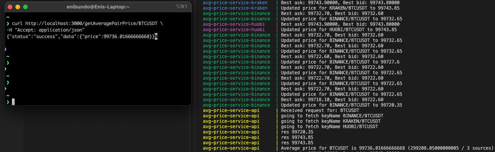

# avg-pair-price

#### Table of contents

1. [Introduction](#introduction)
2. [Architecture](#architecture)
3. [Tech Stack](#tech-stack)

#### Introduction

The aim of this backend is to have an average price of 3 (or more) crypto exchanges for a given pair.

As an example we will focus on the `BTCUSDT` pair but the solution is generic. We can specify granularity of `ENABLED_PAIRS` per each exchange and `ENABLED_EXCHANGES` for the whole system.

We will expose the average price of the requested pair through a REST API for our clients.

Example request:

```sh
curl http://localhost:3000/getAveragePairPrice/BTCUSDT \
-H "Accept: application/json"
```

Success example response:

```json
{
  "status": "success",
  "data": {
    "price": 1.2321
  }
}
```

Failure example response:

```json
{
  "status": "error",
  "error": {
    "message": "Invalid pair FOOBAR"
  }
}
```

Main focus is having a performant, scalable and uncoupled backend system that could scale and upgrade without downtime.

#### Architecture

I went for a microservice architecture. We will have services specialised per exchange (worker services) that will have their lifecycle and one API service that handles user requests.

<div align="center">


Architecture Schema: arrow direction shows information flow direction</div>

<br/>
Everytime a worker service has a new price it will persist it independently.

This architecture permits us to dynamically add new exchanges and decomission old exchanges. We could "temporarily disable" exchanges by configuring the API service to ignore a specific worker service.

Each worker service will be independent and will have different logic to fetch data, respecting specific limits of each exchange, and using specific protocol that the exchanges permit us.

The presentation/api service, whenever called, will compute the average of the latest information we have from each service. We are not interested in historical data in our case and we only need _latest known_ average price.

> 💡 Idea:
> Now we will be reading N (number of enabled exchanges) decimals from redis and calculate their average per each client request. We could further optimise API response time (client side) and calculate the resulting average price _for every exchange price update_ and persist that price _"on the go"_. Whenever we treat a client request we would only make one read. I will not implement this pattern

The persistence will be Redis and we will use its data structure sets (https://redis.io/technology/data-structures/) since we only need to store one value per exchange-currencyPair.

Our persistence will look like this:
| Exchange/Pair | LastPrice |
| :-------------- | :-------: |
| KRAKEN/BTCUSDT | 1.2 |
| BINANCE/BTCUSDT | 1.3 |
| HUOBI/BTCUSDT | 1.35 |

Each entry will have a TTL (let's say 5 seconds, after which it disappears). If a service is down it's persistence slot will not be visible anymore for example.

Here is an example of logs when calculating an average price from real data produced by two services (kraken and binance) for example:



#### Configuration

Not much configuration is needed. There are no secrets in the configuration as we used the public APIs.

Api service knows `ENABLED_EXCHANGES` which permits it to ignore disabled exchanges (even if they are running at some moment).

Each service knows it's name as an env variable called `EXCHANGE_NAME` (which could eventually be static as well). It should match the `ENABLED_EXCHANGES`.

Each worker service knows `ENABLED_PAIRS` list which permits the service to read interesting data.

Api service knows `ENABLED_PAIRS` so it could return error to client if a non-treated pair is requested (even if it is being fetch by one or many workers, we have the choice to not serve it).

In terms of rate limiting:

- HTX: we have 4,000 reqs for 5 minutes permited. It let's us with a comfortable 10 reqs per second (10 \* 60 \* 5 = 3,000 reqs for 5 minutes).
  https://www.htx.com/en-us/opend/newApiPages/?id=7ec4a0fc-7773-11ed-9966-0242ac110003

- KRAKEN: 1 per second seems the suggested rate to not be blocked by them.
  https://support.kraken.com/hc/en-us/articles/206548367-What-are-the-API-rate-limits-#1

#### Tech-Stack

I will use:

- Typescript
- NodeJS
- Express
- Docker
- Redis
