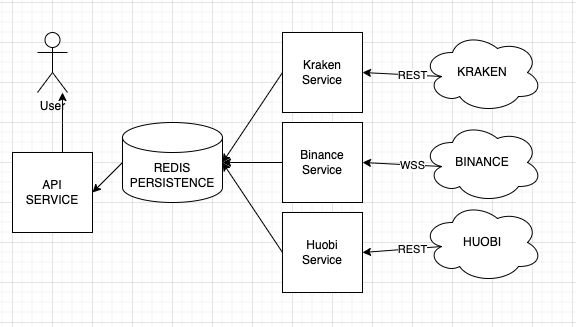

# avg-pair-price

# Table of contents

1. [Introduction](#introduction)
2. [Architecture](#architecture)
3. [Tech Stack](#tech-stack)

#### Introduction

The aim of this backend is to have an average price of 3 (or more) crypto exchanges for a given pair.

As an example we will focus on the `BTCUSD` pair but the solution is generic and could be used for many pairs.

We will expose the average price of the requested pair through a REST API for our clients.

Example request:

```sh
curl http://localhost:3000/getAveragePairPrice/BTCUSDT \
-H "Accept: application/json"
```

Success example response:

```json
{
  "status": "success",
  "data": {
    "price": 1.2321
  }
}
```

Failure example response:

```json
{
  "status": "error",
  "error": {
    "message": "Invalid pair FOOBAR"
  }
}
```

Main focus is having a performant, scalable and uncoupled backend system that could scale and upgrade without downtime.

#### Architecture



There is one service exchange (let's call them worker services) and one service for the API. Everytime a worker service has a new price it will persist it.

This architecture permits us to dynamically add new exchanges and decomission old exchanges. We could "temporarily disable" exchanges by configuring the API service to ignore a specific worker service.

Each worker service will be independent and will have different logic to fetch data, respecting specific limits of each exchange, and using specific protocol that the exchanges permit us.

The presentation/api service, whenever called, will compute the average of the latest information we have from each service. We are not interested in historical data in our case and we only need _latest known_ average price.

The persistence will be Redis and we will use its data structure sets (https://redis.io/technology/data-structures/) since we only need to store one value per exchange-currencyPair.

Our persistence will look like this:

| Exchange/Pair   | LastPrice |
| :-------------- | :-------: |
| KRAKEN/BTCUSDT  |    1.2    |
| BINANCE/BTCUSDT |    1.3    |
| HUOBI/BTCUSDT   |   1.35    |

#### Tech-Stack

I will use:

- Typescript
- NodeJS
- Express
- Docker
- Kubernetes
- Redis
